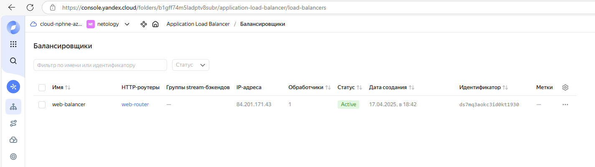

# Дипломная работа по профессии «Системный администратор» - Чернецкий Александр

# Задача
Ключевая задача — разработать отказоустойчивую инфраструктуру для сайта, включающую мониторинг, сбор логов и резервное копирование основных данных. Инфраструктура должна размещаться в Yandex Cloud и отвечать минимальным стандартам безопасности: запрещается выкладывать токен от облака в git. Используйте инструкцию.

Перед началом работы над дипломным заданием изучите Инструкция по экономии облачных ресурсов.

Инфраструктура
Для развёртки инфраструктуры используйте Terraform и Ansible.

Не используйте для ansible inventory ip-адреса! Вместо этого используйте fqdn имена виртуальных машин в зоне ".ru-central1.internal". Пример: example.ru-central1.internal - для этого достаточно при создании ВМ указать name=example, hostname=examle !!

Важно: используйте по-возможности минимальные конфигурации ВМ:2 ядра 20% Intel ice lake, 2-4Гб памяти, 10hdd, прерываемая.

Так как прерываемая ВМ проработает не больше 24ч, перед сдачей работы на проверку дипломному руководителю сделайте ваши ВМ постоянно работающими.

Ознакомьтесь со всеми пунктами из этой секции, не беритесь сразу выполнять задание, не дочитав до конца. Пункты взаимосвязаны и могут влиять друг на друга.

Сайт
Создайте две ВМ в разных зонах, установите на них сервер nginx, если его там нет. ОС и содержимое ВМ должно быть идентичным, это будут наши веб-сервера.

Используйте набор статичных файлов для сайта. Можно переиспользовать сайт из домашнего задания.

Виртуальные машины не должны обладать внешним Ip-адресом, те находится во внутренней сети. Доступ к ВМ по ssh через бастион-сервер. Доступ к web-порту ВМ через балансировщик yandex cloud.

Настройка балансировщика:

Создайте Target Group, включите в неё две созданных ВМ.

Создайте Backend Group, настройте backends на target group, ранее созданную. Настройте healthcheck на корень (/) и порт 80, протокол HTTP.

Создайте HTTP router. Путь укажите — /, backend group — созданную ранее.

Создайте Application load balancer для распределения трафика на веб-сервера, созданные ранее. Укажите HTTP router, созданный ранее, задайте listener тип auto, порт 80.

Протестируйте сайт curl -v <публичный IP балансера>:80

Мониторинг
Создайте ВМ, разверните на ней Zabbix. На каждую ВМ установите Zabbix Agent, настройте агенты на отправление метрик в Zabbix.

Настройте дешборды с отображением метрик, минимальный набор — по принципу USE (Utilization, Saturation, Errors) для CPU, RAM, диски, сеть, http запросов к веб-серверам. Добавьте необходимые tresholds на соответствующие графики.

Логи
Cоздайте ВМ, разверните на ней Elasticsearch. Установите filebeat в ВМ к веб-серверам, настройте на отправку access.log, error.log nginx в Elasticsearch.

Создайте ВМ, разверните на ней Kibana, сконфигурируйте соединение с Elasticsearch.

Сеть
Разверните один VPC. Сервера web, Elasticsearch поместите в приватные подсети. Сервера Zabbix, Kibana, application load balancer определите в публичную подсеть.

Настройте Security Groups соответствующих сервисов на входящий трафик только к нужным портам.

Настройте ВМ с публичным адресом, в которой будет открыт только один порт — ssh. Эта вм будет реализовывать концепцию bastion host . Синоним "bastion host" - "Jump host". Подключение ansible к серверам web и Elasticsearch через данный bastion host можно сделать с помощью ProxyCommand . Допускается установка и запуск ansible непосредственно на bastion host.(Этот вариант легче в настройке)

Исходящий доступ в интернет для ВМ внутреннего контура через NAT-шлюз.

Резервное копирование
Создайте snapshot дисков всех ВМ. Ограничьте время жизни snaphot в неделю. Сами snaphot настройте на ежедневное копирование.

При необходимости включить\создать инфраструктуру прошу написать.

<div align="center"> Весь проект состоит из запуска трех плейбуков:  </div>


get_iam_token.yml     Получение и сохраниение в vault.yml iam токена.
deploy_infra.yml      Создание инфраструктуры с помощью terraform
deploy_software.yml   Установка и настрйока ПО с помощью ролей ansible с использованием динамического инвентаря.
destroy_infra.yml     Полное удаление созданной инфраструктуры.  

Несколько плейбуков оставлено для наглядности.

В процессе выполнения вводить или подтверждать что-либо не требуется.
Секреты хранятся в шифрованном /inventory/production/vault.yml
Ключ ssh от профиля yandex cloud удален, iam токен временный и действовать перестанет.

<div align="center"> Инвентарь будет выглядеть так: </div>

```
---
all:
  vars:
    ansible_user: ubuntu
    ansible_ssh_private_key_file: /home/alexander/.ssh/id_rsa
  children:
    bastion:
      hosts:
        bastion.ru-central1.internal:
    web_servers:
      hosts:
        web-instance-1.ru-central1.internal:
          ansible_ssh_common_args: "-o ProxyJump=ubuntu@bastion.ru-central1.internal"
        web-instance-2.ru-central1.internal:
          ansible_ssh_common_args: "-o ProxyJump=ubuntu@bastion.ru-central1.internal"
    zabbix:
      hosts:
        zabbix-server.ru-central1.internal:
          ansible_ssh_common_args: "-o ProxyJump=ubuntu@bastion.ru-central1.internal"
    elasticsearch:
      hosts:
        elasticsearch-server.ru-central1.internal:
          ansible_ssh_common_args: "-o ProxyJump=ubuntu@bastion.ru-central1.internal"
    kibana:
      hosts:
        kibana-server.ru-central1.internal:
          ansible_ssh_common_args: "-o ProxyJump=ubuntu@bastion.ru-central1.internal"
```

ansible-playbook get_iam_token.yml


ansible-playbook deploy_infra.yml  после выполнения плейбука состояние инфраструктуры можно посмотреть в terraform.tfstate





ansible-playbook deploy_software.yml 


<div align="center"> Мониторинг: </div>


<div align="center"> Логи: </div>


